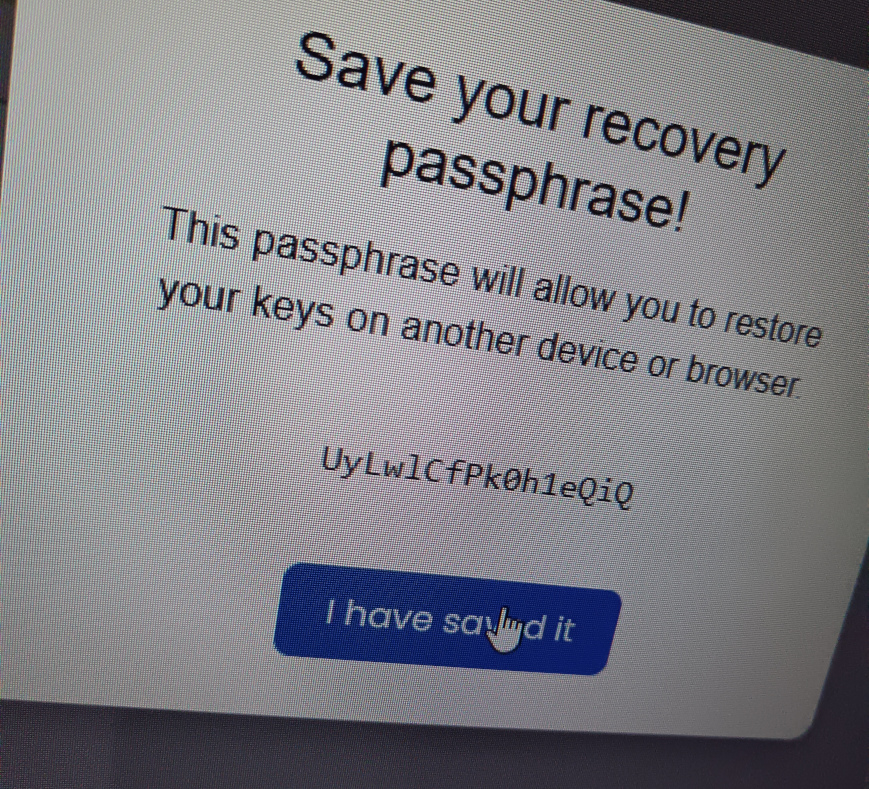
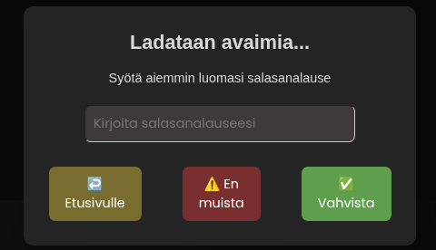
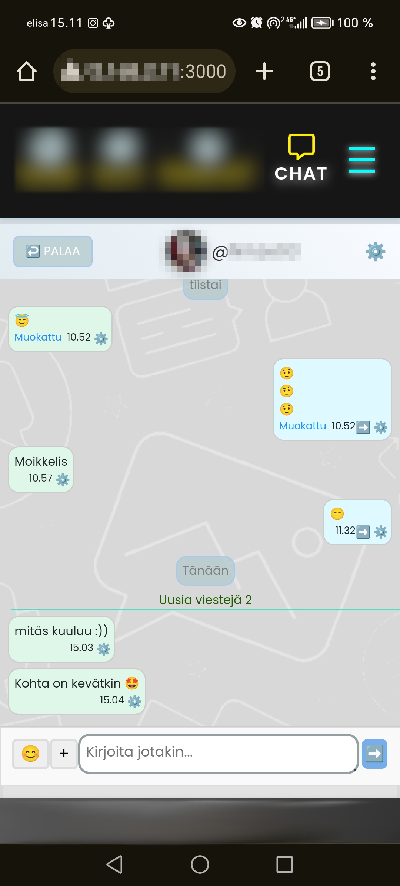

<p align="center">

 [ALGHORITHM](ALGORITHM.md) ||   [LICENCE](LICENCE)

</p>

<p align="center">
  
</p>

# Elisa E2E Chat

Elisa on kahden käyttäjän välinen **päästä-päähän (End-to-End)** salattu reaaliaikainen viestintäsovellus alunperin vuodelta 2025.

Järjestelmän tietoturva nojaa vahvaan **hybridisalaukseen**: viestit kryptataan asiakasohjelmassa **AES-GCM-avaimella**, joka suojataan vastaanottajan julkisella **RSA-OAEP-avaimella**.

**Node.js**-serveri (backend) toimii vain sokeana välittäjänä, eikä sillä ole koskaan pääsyä viestien selväkieliseen sisältöön.

Client on toteutettu **Reactilla**, joka  vastaa käyttöliittymästä sekä kaikista kryptografisista operaatioista suoraan käyttäjän laitteella.

API on **GraphQL** (pääasiallinen datasiirto), **REST** (rest-rajapinnat) ja reaaliaikaisuudesta vastaa **Websockets** viestinvälitys.

Tietokantana toimii **PostgreSQL** (järjestelmä migroitiin alkuperäisestä **MySQL**-toteutuksesta).
Tietokantakyselyistä ja datamallinnuksesta vastaa **Prisma ORM**, johon siirryttiin projektin kehityksen aikana alkuperäisestä **Sequelizen** toteutuksesta.

Käyttäjän yksityinen salausavain johdetaan salasanalauseesta **(Passphrase)**, jota ei koskaan lähetetä palvelimelle. Käyttäjän on muistettava tämä lause itse, sillä sitä tarvitaan avainten käyttöönottoon ja viestien purkamiseen.

**IndexedDB** toimi valinnaisena **pitkäaikaistallennuksena** selaimessa. Tämä tarkoittaa, että jos käyttäjä ei valinnut pitkäaikaistallennusta, avaimet pysyivät vain selaimen välimuistissa (RAM) ja katoavat heti, kun välilehti suljetaan. IndexedDB:n ansiosta istunnon pystyi halutessaan säilyttämään turvallisesti.


<p align="center">
  
  
</p>
<p align="center">
  
</p>

Hybridisen kryptografisen mallin rakenne on:

```text
User RSA Key Pair
        │
        ▼
   AES Key per Message
        │
        ├──────────────┐
        ▼              ▼
 Friend Public Key   Own Public Key
        │              │
        ▼              ▼
Encrypted AES Key   Encrypted AES Key
        │              │
        └──────┬───────┘
               ▼
         AES-GCM CipherText
               │
               ▼
             Server
               │
               ▼
             Client
               │
               ▼
        Private Key
               │
               ▼
            AES Key
               │
               ▼
          Plaintext
```

Projektin alkuperäinen E2E-malli voidaan tiivistää näin:

> Pitkäikäinen käyttäjäkohtainen RSA-avainpari toimii identiteetti- ja avainten suojauskerroksena, kun taas jokainen viesti salataan uudella AES-GCM-avaimella.
Viestin AES-avain salataan erikseen sekä vastaanottajan että lähettäjän RSA-public keyllä.

Tämä muodostaa toimivan hybridisen E2E-rakenteen, mutta ei ole sama asia kuin moderni ratcheting-pohjainen E2E-protokolla.


## 1. Projektin tavoite

Projektin tavoitteena oli toteuttaa yksinkertainen kahden käyttäjän välinen E2E-salattu chat.

Palvelimen tehtävänä on välittää ja tallentaa salattua dataa.

Viestin plaintext ei kuulu palvelimen normaaliin viestinkäsittelyyn.

---

# 2. E2E-salauksen periaate

Projektissa käytetään hybridisalausta.

Hybridimallissa käytetään kahta eri salausmenetelmää eri tarkoituksiin:

* **AES-GCM** salaa varsinaisen viestin
* **RSA-OAEP** salaa AES-avaimen

Tämä on käytännöllinen tapa yhdistää symmetrisen ja asymmetrisen salauksen ominaisuudet.

## Miksi ei salata koko viestiä RSA:lla?

RSA ei ole tarkoitettu suurten viestimäärien tehokkaaseen salaamiseen.

Sen sijaan:

```text
Plaintext
   │
   ▼
AES-GCM
   │
   ├── Ciphertext
   └── AES key
          │
          ▼
       RSA-OAEP
          │
          ▼
   Encrypted AES key
```

RSA:ta käytetään siis vain pienen AES-avaimen suojaamiseen.

---

# 3. Käyttäjän avainpari

Jokaisella käyttäjällä on RSA-avainpari:

```text
RSA Key Pair

┌─────────────────────┐
│ Public Key          │
│                     │
│ voidaan jakaa       │
└─────────┬───────────┘
          │
          │
          ▼
     Database


┌─────────────────────┐
│ Private Key         │
│                     │
│ salainen            │
│                     │
│ käyttäjän hallussa  │
└─────────────────────┘
```

Public key voidaan tallentaa palvelimelle.

Private key puolestaan on salainen avain, jota tarvitaan viestien avaamiseen.

Palvelimelle tallennettu `encryptedKey` ei tarkoita plaintext-muodossa tallennettua private keytä. Se on suojattua avainmateriaalia, jota voidaan käyttää private keyn säilyttämiseen tai palauttamiseen käyttäjän salasanan (passPhrase) avulla.

---

# 4. UserKey tietokanta taulu

Projektissa käyttäjän avaintiedot tallennetaan erilliseen `UserKey`-tauluun.

Keskeiset kentät:

```text
UserKey

AccountID
encryptedKey
publicKey
createdAt
updatedAt
```

### AccountID

Viittaa käyttäjän `AccountID`:hen.

### publicKey

Käyttäjän RSA-public key.

Sitä voidaan käyttää esimerkiksi toisen käyttäjän AES-avaimen salaamiseen.

### encryptedKey

Suojattu avainmateriaali.

Tarkoituksena ei ole säilyttää käyttäjän salaista private keytä plaintext-muodossa tietokannassa.

---

# 5. Viestin salaus

Jokaiselle viestille generoidaan uusi AES-avain.

```js
const aesKey = await generateAESKey();
```

Tämä on tärkeä yksityiskohta:

> Käyttäjän RSA-avainpari ei vaihdu jokaisen viestin yhteydessä, mutta viestin AES-avain vaihtuu.

Eli:

```text
User identity key pair
        │
        │ pitkäikäinen
        ▼
RSA Public / Private Key


Message 1 → AES Key 1
Message 2 → AES Key 2
Message 3 → AES Key 3
Message 4 → AES Key 4
```

---

# 6. AES-GCM

Varsinainen viesti salataan AES-GCM:llä.

Prosessi:

```text
Plaintext
    │
    │ AES-GCM
    │
    ├── AES Key
    └── IV
    │
    ▼
Ciphertext
```

Projektissa AES-avaimen koko on 256 bittiä.

```js
crypto.subtle.generateKey(
    {
        name: "AES-GCM",
        length: 256
    },
    true,
    ["encrypt", "decrypt"]
);
```

Jokaiselle viestille generoidaan myös uusi IV.

```js
const iv = crypto.getRandomValues(
    new Uint8Array(12)
);
```

---

# 7. AES-avaimen salaaminen RSA:lla

Kun viesti on salattu AES-GCM:llä, itse AES-avain suojataan RSA-OAEP:llä.

Vastaanottajalla on oma public key:

```text
Friend Public Key
        │
        ▼
   RSA-OAEP
        │
        ▼
Encrypted AES Key
```

Tämän ansiosta vain vastaanottaja, jolla on vastaava private key, voi avata AES-avaimen.

---

# 8. AES-avain salataan kahdelle käyttäjälle

Projektin toteutuksessa sama viestin AES-avain salataan kaksi kertaa.

Ensimmäinen salaus tehdään vastaanottajan public keyllä:

```text
AES Key
   │
   ▼
Friend Public Key
   │
   ▼
encryptedAesKeyFriend
```

Toinen salaus tehdään lähettäjän omalla public keyllä:

```text
AES Key
   │
   ▼
Own Public Key
   │
   ▼
encryptedAesKeyOwn
```

Tämän seurauksena viestin tietorakenne sisältää:

```js
{
    encryptedAesKeyFriend,
    encryptedAesKeyOwn,
    iv,
    cipherText
}
```

---

# 9. Miksi AES-avain salataan myös lähettäjälle?

Lähettäjän täytyy pystyä avaamaan omat lähettämänsä viestit myöhemmin.

Siksi sama AES-avain suojataan myös lähettäjän public keyllä.

```text
                    AES Key
                   /       \
                  /         \
                 ▼           ▼
        Friend Public Key   Own Public Key
                 │           │
                 ▼           ▼
 encryptedAesKeyFriend  encryptedAesKeyOwn
```

Kun lähettäjä haluaa lukea viestin:

```text
encryptedAesKeyOwn
        │
        ▼
Own Private Key
        │
        ▼
AES Key
        │
        ▼
cipherText + IV
        │
        ▼
Plaintext
```

Vastaanottaja käyttää vastaavasti:

```text
encryptedAesKeyFriend
        │
        ▼
Friend Private Key
        │
        ▼
AES Key
        │
        ▼
cipherText + IV
        │
        ▼
Plaintext
```

---

# 10. Viestin tietokantarakenne

Viestit tallennetaan `Message`-malliin.

Keskeiset kentät ovat:

```text
id
ChatID
AccountID
Status
encrypted
encryptedAesKeyFriend
encryptedAesKeyOwn
iv
cipherText
```

### id

Viestin yksilöllinen tunniste.

### ChatID

Viittaa keskusteluun.

### AccountID

Viestin lähettäjä.

### Status

Viestin tila:

```text
SENDED
READED
```

### encrypted

Kertoo, onko viesti salattu.

### encryptedAesKeyFriend

AES-avaimen RSA-OAEP-salattu versio vastaanottajalle.

### encryptedAesKeyOwn

AES-avaimen RSA-OAEP-salattu versio lähettäjälle.

### iv

AES-GCM:n käyttämä initialization vector.

### cipherText

Varsinainen AES-GCM-salattu viesti.

---

# 11. Koko viestin salausprosessi

Kun käyttäjä lähettää viestin:

```text
User A
  │
  │ "Hello"
  ▼
Client
  │
  │ 1. Generate AES-256 key
  ▼
AES Key
  │
  │ 2. Encrypt message with AES-GCM
  ▼
CipherText
  │
  ├───────────────────────┐
  │                       │
  │ 3. RSA-OAEP           │ 3. RSA-OAEP
  │                       │
  ▼                       ▼
Friend Public Key      Own Public Key
  │                       │
  ▼                       ▼
encryptedAesKeyFriend  encryptedAesKeyOwn
  │                       │
  └───────────┬───────────┘
              │
              ▼
          Message Object
```

Lopputulos:

```js
{
    encryptedAesKeyFriend,
    encryptedAesKeyOwn,
    iv,
    cipherText
}
```

Tämä data voidaan lähettää palvelimelle.

---

# 12. Viestin avaaminen

Vastaanottaja saa salatun viestin.

Ensimmäiseksi hän käyttää omaa private keytä AES-avaimen avaamiseen.

```text
encryptedAesKeyFriend
          │
          ▼
     RSA-OAEP
          │
          ▼
    Private Key
          │
          ▼
       AES Key
```

Sen jälkeen AES-avaimella avataan varsinainen viesti:

```text
CipherText + IV
       │
       ▼
    AES-GCM
       │
       ▼
   Plaintext
```

---

# 13. Client-side cryptography

Salaus toteutetaan selaimen Web Cryptography API:n avulla.

Keskeisiä API-toimintoja ovat:

```text
crypto.subtle.generateKey()
crypto.subtle.encrypt()
crypto.subtle.decrypt()
crypto.subtle.importKey()
crypto.subtle.exportKey()
```

Private key voidaan importata esimerkiksi:

```js
export async function importPrivateKey(jwk) {
    return await window.crypto.subtle.importKey(
        "jwk",
        jwk,
        {
            name: "RSA-OAEP",
            hash: {
                name: "SHA-256"
            }
        },
        true,
        ["decrypt"]
    );
}
```

---

# 14. Salausalgoritmit

Projektin keskeinen kryptografinen kokonaisuus:

| Osa                    | Algoritmi      |
| ---------------------- | -------------- |
| Viestin salaus         | AES-GCM        |
| AES-avain              | 256 bit        |
| AES IV                 | 12 bytes       |
| AES authentication tag | 128 bit        |
| Avaimen suojaus        | RSA-OAEP       |
| RSA hash               | SHA-256        |
| Avainten formaatti     | JWK            |
| Kryptografinen API     | Web Crypto API |

---

# 15. Miksi AES-GCM?

AES-GCM tarjoaa sekä:

* luottamuksellisuuden
* eheyden/autentikoinnin

Tämä tarkoittaa, että viestin muuttaminen salauksen jälkeen voidaan havaita purkuvaiheessa.

Mallissa:

```text
Plaintext
    │
    ▼
 AES-GCM
    │
    ├── CipherText
    ├── IV
    └── Authentication Tag
```

---

# 16. Palvelimen rooli

E2E-mallissa palvelin ei tarvitse viestin plaintextia viestin välittämiseen.

Palvelimelle voidaan toimittaa esimerkiksi:

```text
Chat ID
Sender
Recipient
CipherText
IV
Encrypted AES Key
```

Palvelin toimii tällöin ensisijaisesti viestien:

* välittäjänä
* tallentajana
* keskustelujen hallinnoijana

Salaus ja salauksen purkaminen tapahtuvat client-puolella.

---

# 17. Salasanan ja avainten suhde

Käyttäjän salasana liittyy private keyn suojaukseen.

Tavoitteena on, ettei salaista avainmateriaalia tarvitse säilyttää tietokannassa sellaisenaan.

Yksinkertaistettuna:

```text
Password
    │
    ▼
Key protection
    │
    ▼
Encrypted private-key material
```

Kun käyttäjä palauttaa avaimensa oikean salasanan avulla, client voi käyttää private keytä viestien avaamiseen.

---

# 18. Mitä jos käyttäjä unohtaa salasanan?

Tässä mallissa vanhan private keyn menettäminen on merkittävä asia.

Jos käyttäjä:

1. unohtaa salasanansa
2. ei pysty palauttamaan vanhaa private keytä
3. luo kokonaan uuden RSA-avainparin

niin vanhalla avainparilla salatut viestit eivät enää avaudu uudella private keyllä.

Esimerkiksi:

```text
Old Key Pair
     │
     ├── Old Public Key
     └── Old Private Key
             │
             ▼
       Old messages
```

Uusi avainpari:

```text
New Key Pair
     │
     ├── New Public Key
     └── New Private Key
```

Uusi private key ei pysty avaamaan vanhalla public keyllä suojattua AES-avainta.

---

# 19. Vanhojen viestien palautuminen

Koska AES-avain salattiin viestin yhteydessä sekä lähettäjälle että vastaanottajalle, keskustelukumppani voi edelleen pystyä lukemaan vanhan viestin.

Esimerkiksi:

```text
Old message
     │
     ├── encryptedAesKeyOwn
     │        │
     │        └── Old Private Key
     │
     └── encryptedAesKeyFriend
              │
              └── Friend Private Key
```

Jos lähettäjä menettää oman vanhan private keynsä, vastaanottajan avain ei automaattisesti katoa.

Tämä on yksi syy siihen, miksi AES-avain salattiin kahdelle osapuolelle.

---

# 20. Avainparin vaihtaminen

Käyttäjän RSA-avainpari on tässä mallissa pitkäikäinen.

Sitä ei generoida uudelleen jokaisen viestin kohdalla.

Sen sijaan:

```text
User
 │
 └── RSA Key Pair
       │
       ├── Public Key
       └── Private Key
```

Viestikohtainen AES-avain vaihtuu:

```text
Message 1 → AES 1
Message 2 → AES 2
Message 3 → AES 3
Message 4 → AES 4
```

Tämä ero on tärkeä.

**Staattinen käyttäjäavain ei tarkoita staattista viestiavainta.**

---

# 21. Vanha E2E-malli vs. moderni E2E

Tämä projekti edustaa yksinkertaista mutta oikeaa hybridimuotoista E2E-ratkaisua.

Sen keskeinen malli on:

```text
Persistent RSA identity key pair
              │
              ▼
       Message AES key
              │
       ┌──────┴──────┐
       ▼             ▼
 Recipient key     Own key
       │             │
       ▼             ▼
Encrypted AES     Encrypted AES
key               key
```

Modernit E2E-protokollat voivat edelleen käyttää pitkäikäisiä käyttäjäkohtaisia identiteettiavaimia.

Merkittävä ero on siinä, mitä niiden ympärille rakennetaan.

Modernissa E2E-järjestelmässä voidaan käyttää esimerkiksi:

```text
Identity Keys
     │
     ▼
Session Establishment
     │
     ▼
Ratchet State
     │
     ▼
Changing Message Keys
```

Tällöin avainmateriaali kehittyy viestinnän aikana eikä jokainen viesti perustu ainoastaan samaan pitkäikäiseen identiteettiavaimeen.

---

# 22. Mitä modernissa E2E:ssä tehdään eri tavalla?

Modernissa ratcheting-pohjaisessa E2E-mallissa käyttäjän identiteettiavain toimii enemmän identiteetin ja luottamussuhteen ankkurina.

Sen ympärille muodostetaan istuntokohtainen kryptografinen tila.

Esimerkiksi:

```text
Identity Key
      │
      ▼
Session
      │
      ▼
Ratchet
      │
      ├── Message Key 1
      ├── Message Key 2
      ├── Message Key 3
      └── Message Key 4
```

Tämä mahdollistaa ominaisuuksia, joita tämän projektin alkuperäisessä mallissa ei ole samalla tavalla toteutettu.

Näihin voivat kuulua esimerkiksi:

* avainmateriaalin jatkuva eteneminen
* istuntokohtainen avainmateriaali
* viestikohtaisten avainten johtaminen
* parempi suojaus joidenkin avainten myöhempää paljastumista vastaan
* monimutkaisempi avainten palautus ja synkronointi

---

# 23. Mikä tässä projektissa oli yksinkertaista?

Alkuperäinen toteutus ei ollut moderni Signal-tyylinen ratcheting-protokolla.

Se ei sisältänyt esimerkiksi:

```text
Double Ratchet
Signal-style session protocol
Continuous key-chain evolution
Modern multi-device session management
```

Sen sijaan siinä oli selkeä hybridimalli:

```text
Persistent user RSA key pair
+
New AES key per message
+
RSA-OAEP wrapped AES key
+
AES-GCM encrypted message
```

Tämä tekee toteutuksesta suhteellisen suoraviivaisen ymmärtää.

---

# 24. Projektin vahvuus teknisenä harjoituksena

Vaikka toteutus on yksinkertainen verrattuna moderneihin E2E-protokolliin, siinä on useita oikean kryptografisen järjestelmän perusperiaatteita:

* symmetrisen ja asymmetrisen salauksen yhdistäminen
* avainten hallinta
* public/private key -malli
* viestikohtainen AES-avain
* AES-GCM
* RSA-OAEP
* client-side encryption
* salatun datan tallentaminen
* käyttäjäkohtaiset avaimet
* avaimen palauttamisen ongelman huomiointi

Kyseessä ei siis ole pelkkä "salataan teksti RSA:lla" -toteutus.

---

# 25. Alkuperäisen toteutuksen kehitysvaiheet

Clientin kryptografisessa koodissa näkyy myös projektin kehityshistoria.

Mukana on ollut useampia kokeiluja ja toteutusversioita, kuten:

```text
RSA-only encryption
        │
        ▼
Hybrid encryption
        │
        ▼
AES-GCM + RSA-OAEP
        │
        ▼
AES key encrypted for both users
```

Koodissa on tämän seurauksena vanhempia/duplikaatteja kryptografisia funktioita.

---

# 26. Nykyisen toteutuksen keskeiset funktiot

Kryptografisessa client-koodissa keskeisiä toimintoja ovat:

```text
generateAESKey()
encryptMessageAES()
encryptAESKeyRSA()
encryptHybridMessage()

importPrivateKey()
decryptAESKey()
decryptMessageAES()
decryptHybridMessage()
```

Säilytettävä päälogiikka voidaan hahmottaa näin:

```text
ENCRYPT

generateAESKey
      │
      ▼
encryptMessageAES
      │
      ├── cipherText
      └── iv
      │
      ▼
encryptAESKeyRSA
      │
      ├── Friend Public Key
      └── Own Public Key
      │
      ▼
Message Object
```

Ja purku:

```text
DECRYPT

encryptedAesKey
      │
      ▼
RSA Private Key
      │
      ▼
AES Key
      │
      ▼
cipherText + iv
      │
      ▼
AES-GCM
      │
      ▼
Plaintext
```

---

# 27. Projektin rajoitukset

Alkuperäinen toteutus ei ole tarkoitettu nykyajan valmiiksi tuotantotason E2E-protokollaksi.

Keskeisiä rajoituksia ovat muun muassa:

* ei Double Ratchet -protokollaa
* ei jatkuvasti kehittyvää session key -ketjua
* ei modernia multi-device-key managementia
* ei kattavaa key verification -järjestelmää
* avainparin menettäminen vaikuttaa vanhojen omien viestien palauttamiseen
* kryptografinen protokolla on sovelluskohtainen eikä standardoitu viestiprotokolla
* client-koodiin on jäänyt vanhempia kryptografisia toteutuksia

Näistä huolimatta alkuperäinen ratkaisu muodostaa selkeän pohjan hybridisen E2E-salauksen ymmärtämiselle.

---

# 28. Arkkitehtuuri

Kokonaisuus voidaan jakaa kolmeen pääosaan:

```text
┌─────────────────────┐
│       Client        │
│                     │
│  UI                 │
│  Authentication     │
│  Key Management     │
│  Encryption         │
│  Decryption         │
└──────────┬──────────┘
           │
           │ HTTPS / API
           ▼
┌─────────────────────┐
│       Backend       │
│                     │
│  Authentication     │
│  Chat Management    │
│  Message Handling   │
│  Database Access    │
└──────────┬──────────┘
           │
           ▼
┌─────────────────────┐
│      Database       │
│                     │
│ Users               │
│ UserKey             │
│ Chats               │
│ Messages            │
└─────────────────────┘
```

Salauslogiikka kuuluu client-puolelle.

---

# 29. Viestin kulku

Koko viestin elinkaari:

```text
User writes message
        │
        ▼
Client creates AES key
        │
        ▼
AES-GCM encrypts plaintext
        │
        ▼
AES key encrypted with
recipient public key
        │
        ▼
AES key encrypted with
sender public key
        │
        ▼
Encrypted message sent
to backend
        │
        ▼
Backend stores/transfers
encrypted data
        │
        ▼
Recipient receives message
        │
        ▼
Recipient private key
decrypts AES key
        │
        ▼
AES-GCM decrypts message
        │
        ▼
Plaintext displayed
```

---

# 30. Security model

Projektin perusajatuksena on, että palvelimen ei tarvitse tietää viestin sisältöä.

Luottamusmalli:

```text
User A
   │
   │ encrypted
   ▼
Server
   │
   │ encrypted
   ▼
User B
```

Serveri ei tarvitse:

```text
User A private key
User B private key
Plaintext message
```

Vastaanottajan private key tarvitaan varsinaisen viestin avaamiseen.

---

# 31. Mitä projekti opetti?

Projektin kautta voidaan hahmottaa käytännössä:

### Symmetrinen salaus

```text
AES
```

### Asymmetrinen salaus

```text
RSA
```

### Hybridisalaus

```text
AES + RSA
```

### Key management

```text
Public key
Private key
Encrypted key material
```

### Client-side cryptography

```text
Web Crypto API
```

### E2E-ajattelu

```text
Encrypt before transmission
Decrypt only at endpoint
```

---

# 32. Tulevaisuuden kehitys

Jos projektista rakennetaan joskus uusi modernimpi versio, mahdollisia kehityssuuntia ovat:

* selkeämpi key management
* moderni session establishment
* ratcheting
* viestikohtaisesti kehittyvä key material
* key verification
* turvallisempi private key storage
* multi-device support
* key rotation
* session recovery
* replay protection
* message authentication
* paremmin määritelty kryptografinen protokolla
* testattu threat model
* kryptografisten komponenttien keskittäminen yhteen moduuliin

---

# 33. Terminologia

Projektissa käytetään seuraavia termejä:

| Termi             | Merkitys                                              |
| ----------------- | ----------------------------------------------------- |
| Public Key        | Käyttäjän jaettava RSA-julkinen avain                 |
| Private Key       | Käyttäjän salainen RSA-avain                          |
| Identity Key Pair | Käyttäjän pitkäikäinen avainpari                      |
| AES Key           | Yksittäisen viestin symmetrinen avain                 |
| AES-GCM           | Viestin symmetrinen salausmenetelmä                   |
| RSA-OAEP          | AES-avaimen suojaamiseen käytetty asymmetrinen salaus |
| IV                | AES-GCM:n initialization vector                       |
| CipherText        | Salattu viestisisältö                                 |
| E2E               | End-to-End Encryption                                 |
| Hybrid Encryption | Symmetrisen ja asymmetrisen salauksen yhdistelmä      |
| Ratchet           | Avainmateriaalin jatkuvasti etenevä mekanismi         |

---

# 34. Staattinen avainpari – tarkka merkitys

Tässä projektissa käytetty termi **static key** tarkoittaa käyttäjäkohtaista pitkäikäistä avainparia.

Se ei tarkoita:

> "Sama AES-avain käytetään kaikissa viesteissä."

Päinvastoin.

Projektissa:

```text
RSA identity key pair
        │
        │ pitkäikäinen
        ▼
User identity


AES key
        │
        │ uusi jokaiselle viestille
        ▼
Individual message
```

Täsmällinen termi mallille on:

**Staattiseen käyttäjäkohtaiseen avainpariin perustuva hybridimuotoinen E2E-salaus.**

Englanniksi:

**Static-Key Hybrid E2E Encryption**

---

# 35. Yhteenveto

Projektin modernisoinnin kannalta luonnollinen seuraava askel olisi erottaa toisistaan:

```text
Identity
   │
   ▼
Session
   │
   ▼
Key Agreement
   │
   ▼
Ratchet
   │
   ▼
Message Keys
```

Tällöin alkuperäisen projektin hybridisalaus toimii hyvänä lähtökohtana modernimman E2E-arkkitehtuurin ymmärtämiselle ja suunnittelulle.


********************************
Itselle muistii, eroteltu alkuperäisestä "client"
ja "backend"  reposta. Git clonattu uusi chat-backend-client, tehty siihen copy-paste. 
Ilman commit historiaa.

commit hard-reset

Client
2edd12e78c62b7de429e219efde8bf5cc4e92e3b

Backend
git reset --hard 454610518340f00736b68b5ff1522dbc45a3c476


## 📄 License

**Coderinna Proprietary License 1.0**

This project is proprietary software owned by **Coderinna**.

No rights are granted to copy, modify, distribute, sublicense, sell, or create derivative works from this project.

Commercial, organizational, corporate, hosted, SaaS, and other third-party use is **not permitted** without prior written permission from Coderinna.

All rights are reserved unless explicitly granted in writing.

For the complete terms, see the [`LICENSE`](./LICENSE) file.
